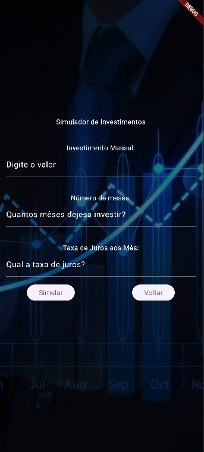
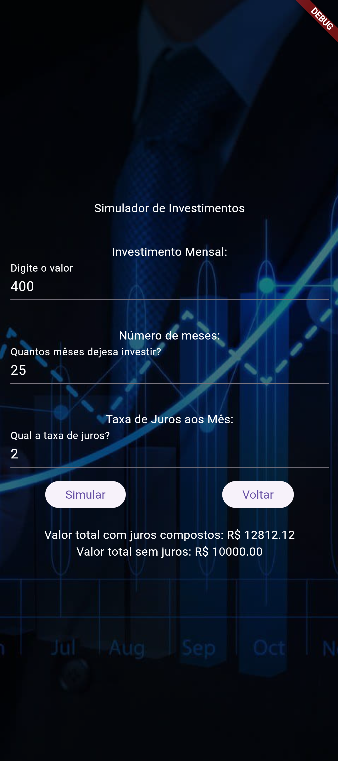
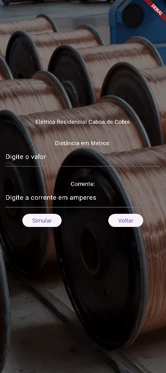
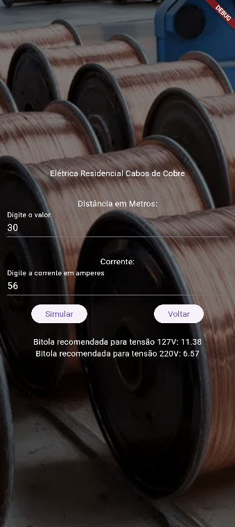
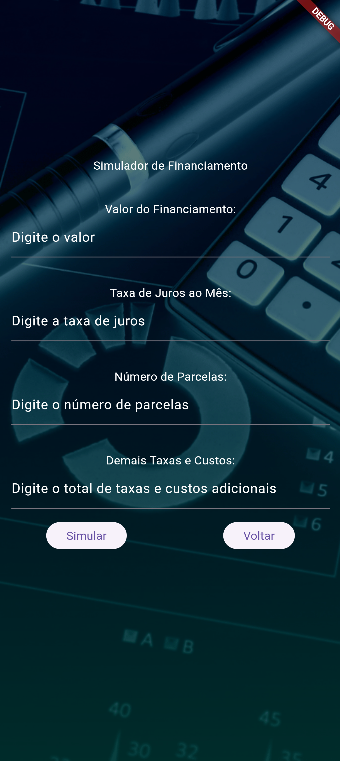
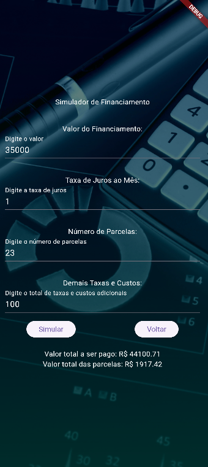

# Aula 6

## Sobre o projeto
O projeto tem como objetivo criar formulários com o flutter, visando o aprendizado com desafios. Os formulários deveriam ser: simulador de financiamento, investimento e calculadora de bitola. Além do desafio, há a necessidade de criar protótipos no figma, reproduzindo as telas feitas no flutter, permitindo interação.

## Print das telas:
Para apresentar melhor o projeto, aqui estão algumas imagens das telas criadas para os desafios:

### Investimento:
| Tela 1 | Tela 2 | Tela 3 |
| :------: | :----: | :----------: |
| |  |  |

### Bitola:
| Tela 1 | Tela 2 | Tela 3 |
| :------: | :----: | :----------: |
| |  |  |

### Financiamento:
| Tela 1 | Tela 2 | Tela 3 |
| :------: | :----: | :----------: |
| |  |  |
